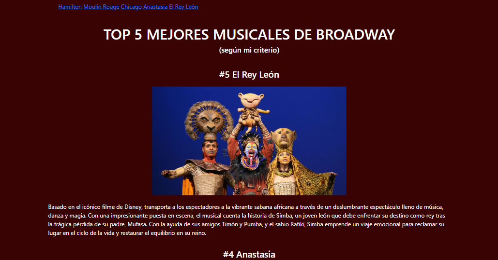
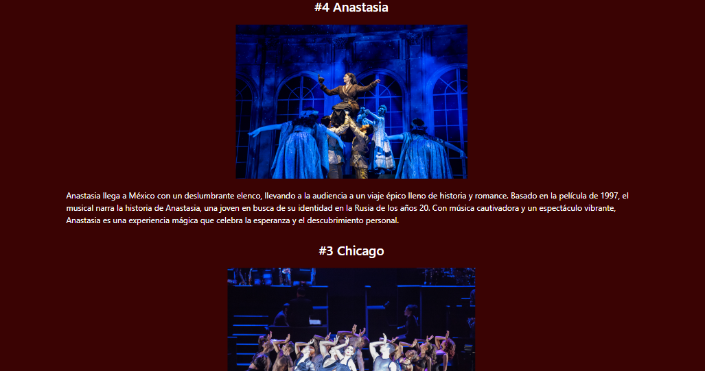
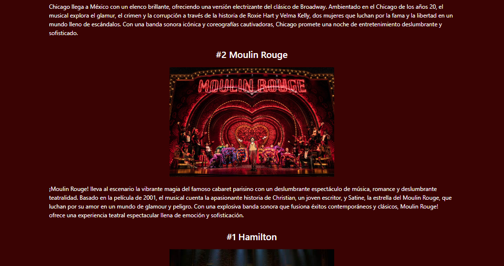
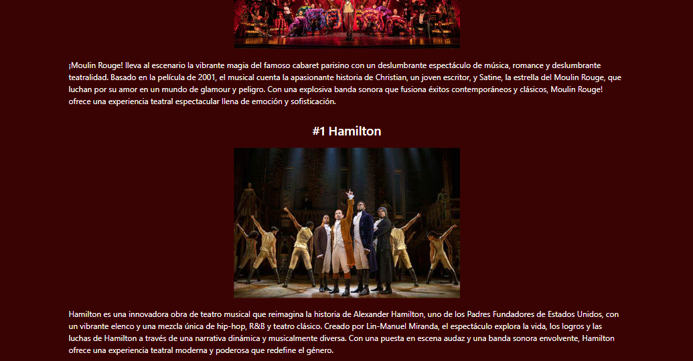

# Mi portafolio de TECNOLOCHICAS PRO

El presente proyecto es parte de portafolio desarrollado para poner en práctica las habilidades obtenidas dentro del bootcamp de desarrollo frontend de Tecnolochicas Pro. 

Fue dessarrollado en HTML y CSS

La página es responsibla (adaptable a diferentes tamaños de pantalla). 

Proyecto desplegado https://miprimerapagina-victoriabalderas.netlify.app/

## Contenido de mi sitio 

## Tecnologías 
* HTML
* CSS
---
Desarrollado con <3 por [Victoria](https://linkedin.com/in/victoria-balderass) en [Tecnolochicas](https://tecnolochicas.mx/)
